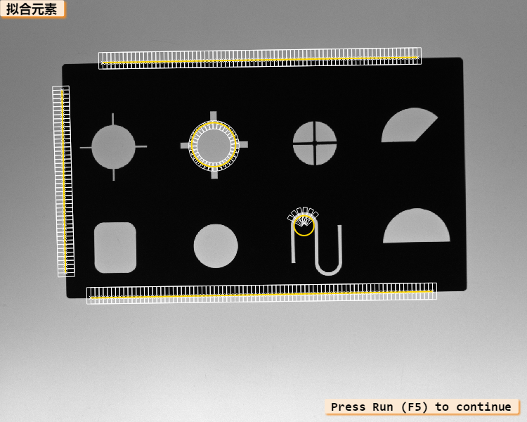
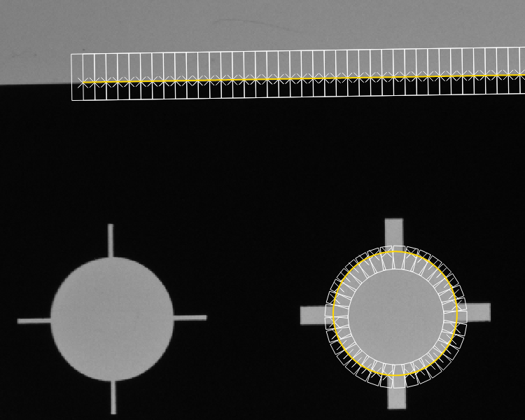
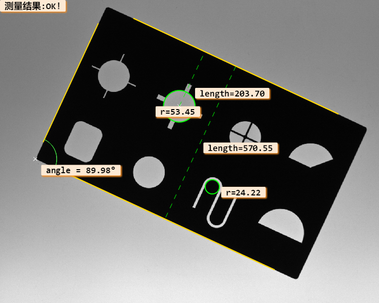

# Halcon二维尺寸自动测量例程

> 本项目使用Halcon中的Metrology Model和模板匹配方法，实现了一个能够自动测量零件尺寸的例程。

## 效果

截图如下：

## 运行环境

- Halcon 13

## 项目说明

- 无需搭建其他环境，克隆仓库，在HDevelop中运行即可。

- 可以自动拟合指定位置的直线，圆等

- 可以测量角度，长度，距离等

  

